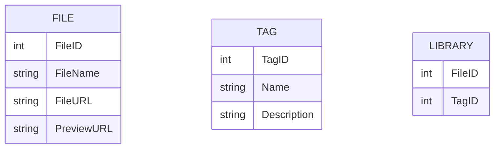

# Architecture

Technical stack:

- Go
- Docker
- Postgres for user data
- MinIO for storing files

## Database

```mermaid
erDiagram

FILE {
    int FileID
    string FileName
    string FileURL
    string PreviewURL
}

TAG {
    int TagID
    string Name
    string Description
}

LIBRARY {
    int FileID
    int TagID
}

```
